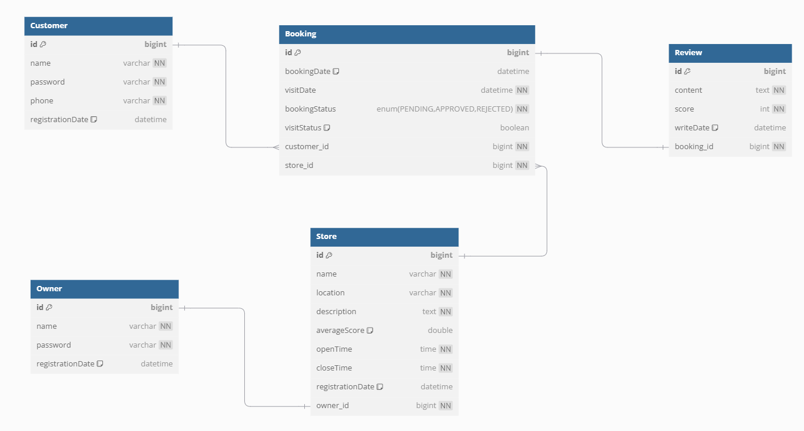

# Store Table Reservation Service

## 개요

이 프로젝트는 매장 예약 시스템을 구현한 서비스입니다. 고객은 매장을 검색하고, 예약하고, 리뷰를 작성할 수 있으며, 점주는 매장을 등록하고 예약을 승인하거나 거절하며, 고객이 작성한 리뷰를 관리할 수 있습니다. 또한, 키오스크를 통해 고객은 예약 내역을 조회하고 방문 완료 처리를 할 수 있습니다.

## 기술 스택

- **IDE**: Eclipse
- **JDK**: Java 17
- **Framework**: Spring Boot 3.4.2
- **Build Tool**: Gradle (Groovy)
- **Database**: MariaDB 10.6.20

## 프로젝트 구조

### 고객 페이지 (Port: 8080)

고객이 매장을 검색하고 예약하며, 예약 후 리뷰를 작성하고 조회할 수 있는 기능을 제공합니다.

#### 주요 기능

- **상단 메뉴**
  - **회원 메뉴**:
    - 예약 목록
    - 리뷰 목록
    - 로그아웃
  - **비회원 메뉴**:
    - 로그인
    - 회원가입
- **회원 가입**
  - 이름과 전화번호 중복 검사를 통해 중복된 값 입력 시 회원가입 실패.
  - 비밀번호 입력 필드 값과 확인 비밀번호 입력 필드 값이 맞지 않으면 회원 가입 요청 실패.
  - 비밀번호는 Bcrypt 라이브러리를 사용하여 암호화하여 저장.
- **로그인**
  - 로그인 시 이름과 비밀번호를 입력받고, 로그인 성공 시 세션에 `회원 id`를 저장.
- **매장 목록**
  - 점주 페이지에 등록된 매장 목록을 조회.
  - 매장 이름으로 검색 가능.
  - 최신 등록순, 이름순, 별점순으로 정렬 조회 가능.
  - 한 페이지당 10개씩 보여주는 페이징 처리 적용.
  - 매장 이름 클릭 시, 해당 매장의 상세 정보 페이지로 이동.
- **매장 상세 페이지**
  - 클릭한 매장의 상세 정보 출력.
  - '예약하기' 버튼을 클릭하여 예약 페이지로 이동.
  - 비회원일 경우 '로그인 후 예약해주세요' 알림창이 뜨며 예약 페이지로 이동하지 않음.
- **예약 신청 페이지**
  - 방문 날짜와 시간을 선택하여 '예약하기' 버튼을 클릭하여 예약 신청 가능.
  - 예약 시간은 해당 매장의 운영 시간 내에 선택 가능하며, 30분 단위로 방문 시간 리스트가 출력.
  - 예약 마감 시간 1시간 전까지 예약 가능.
  - 같은 날짜에 등록된 예약은 예약 실패.
  - 같은 매장에 1일 1건 예약 정책: 같은 날짜에 이미 예약된 경우 예약 실패.
- **예약 목록**
  - 고객이 예약한 목록을 조회.
  - 예약 상태는 기본적으로 '예약 대기'로 설정되며, 점주가 예약을 승인하면 '예약 승인' 상태로 변경됨.
  - 방문 완료된 예약 건에 대해서는 리뷰 작성 또는 리뷰 보기 버튼이 표시.
- **리뷰 작성**
  - 예약 목록에서 방문 완료된 예약 건에 '리뷰 작성' 버튼을 클릭하면 리뷰 작성 페이지로 이동.
  - 점수와 리뷰 내용을 작성하고 '리뷰 작성하기' 버튼을 클릭하여 리뷰 작성.
  - 리뷰 작성 시, 해당 매장의 리뷰 목록을 조회하고 별점 평균을 계산하여 저장.
- **리뷰 목록**
  - 고객이 작성한 리뷰 목록을 조회.
  - 리뷰 내용을 클릭하면 해당 리뷰의 상세 페이지로 이동.
- **리뷰 상세 페이지**
  - 클릭한 리뷰의 정보를 출력.
  - 리뷰 수정 및 삭제가 가능.

### 점주 페이지 (Port: 8081)

점주가 매장을 등록하고 고객의 예약을 승인하거나 거절하며, 고객이 작성한 리뷰를 관리할 수 있는 기능을 제공합니다.

#### 주요 기능

- **상단 메뉴**
  - **회원 메뉴**:
    - 매장 정보
    - 예약 목록
    - 리뷰 목록
    - 로그아웃
  - **비회원 메뉴**:
    - 로그인
    - 회원가입
- **회원 가입**
  - 이름과 중복된 값 입력 시 회원가입 실패.
  - 비밀번호 입력 필드 값과 확인 비밀번호 입력 필드 값이 맞지 않으면 회원 가입 요청 실패.
  - 비밀번호는 Bcrypt 라이브러리를 사용하여 암호화하여 저장.
- **로그인**
  - 이름과 비밀번호를 입력하여 로그인.
  - 로그인 성공 시 세션에 `점주 id`를 저장.
- **매장 정보 관리**
  - 매장 등록이 없는 경우 '등록된 매장이 없습니다' 메시지와 '매장 등록' 버튼 표시.
  - 매장 등록 후, 등록된 매장 정보가 출력되며 수정 및 삭제가 가능.
- **매장 등록 페이지**
  - 매장 이름, 오픈 시간, 마감 시간, 위치, 매장 설명 등을 입력하여 '매장 등록' 버튼을 클릭하여 매장 등록.
- **예약 목록**
  - 고객이 예약한 목록을 조회.
  - 예약을 승인하거나 거절할 수 있음.
  - 예약이 거절되면 고객은 키오스크에서 방문 신청을 할 수 없게 됨.
- **리뷰 목록**
  - 고객이 작성한 리뷰 목록을 조회.
  - 리뷰 내용 클릭 시, 리뷰 상세 페이지로 이동.
- **리뷰 상세 페이지**
  - 클릭한 리뷰 정보가 출력되며, 리뷰 삭제가 가능.

### 키오스크 (Port: 8082)

고객이 매장에 방문하여 예약 내역을 조회하고 방문 완료 처리를 요청하는 기능을 제공합니다.

#### 주요 기능

- **관리자 로그인**
  - 등록된 이름과 비밀번호로 로그인 시, 키오스크 홈으로 이동.
  - 점주가 매장을 등록하지 않은 경우 로그인 실패.
  - 로그인 성공 시 세션에 점주 id, 매장 id, 매장 이름을 저장.
- **로그아웃**
  - 세션에 저장된 점주 id 및 매장 id를 삭제하고, 관리자 로그인 페이지로 이동.
- **키오스크 홈**
  - 고객은 매장에 방문하여 키오스크에서 전화번호를 입력하고 '예약 조회'를 클릭.
  - 고객 정보가 없거나 금일 예약건이 없는 경우 조회 실패.
- **예약 조회**
  - 예약자명, 방문시간, 방문 상태가 표시.
  - 방문 완료 처리가 되지 않았으면 '방문 완료' 버튼을 클릭하여 방문 처리 요청.
  - 방문 가능 시간은 예약 시간 1시간 전부터 10분 전까지.
  - 예시: 예약 시간이 `2025년 2월 3일 20시 30분`이라면 방문 완료 요청 가능 시간은 `2025년 2월 3일 19시 30분`부터 `2025년 2월 3일 20시 20분`까지.
  - 점주가 승인하지 않은 예약건인 경우 조회 실패.
  - 방문 완료 처리 후 '방문 완료' 문구로 표시.

## 비즈니스 로직

### 회원 가입 / 로그인
- **회원 가입**: 이름과 전화번호 중복 체크 후 비밀번호는 암호화하여 저장. 
- **로그인**: 로그인 시 세션에 회원 id 또는 점주 id 저장.

### 매장 등록 및 관리
- **점주 페이지**에서 매장 등록 및 관리 기능을 제공.
- **매장 정보 수정**: 등록된 매장에 대해 수정 및 삭제 가능.

### 예약 처리
- **고객 예약 신청**: 매장 상세 페이지에서 예약을 신청하며, 1일 1건 예약 정책 및 중복 예약 방지.
- **예약 승인 및 거절**: 점주가 예약을 승인하거나 거절할 수 있음.
- **예약 상태**: 예약 상태는 기본적으로 '예약 대기'이며, 점주가 승인 시 '예약 승인'으로 변경됨.

### 리뷰 작성 및 관리
- **리뷰 작성**: 고객은 방문 완료된 예약 건에 대해 리뷰 작성.
- **리뷰 평균 별점 계산**: 매장의 리뷰 평균 별점 계산 후 저장.

### 키오스크 예약 조회 및 방문 완료 처리
- **예약 조회**: 고객의 예약을 전화번호를 통해 조회하며, 점주가 승인하지 않은 예약은 조회되지 않음.
- **방문 완료 처리**: 예약 시간 1시간 전부터 10분 전까지 방문 완료 처리가 가능.

## 실행 방법# Store Table Reservation Service

## 개요

이 프로젝트는 매장 예약 시스템을 구현한 서비스입니다. 고객은 매장을 검색하고, 예약하고, 리뷰를 작성할 수 있으며, 점주는 매장을 등록하고 예약을 승인하거나 거절하며, 고객이 작성한 리뷰를 관리할 수 있습니다. 또한, 키오스크를 통해 고객은 예약 내역을 조회하고 방문 완료 처리를 할 수 있습니다.

## 기술 스택

- **IDE**: Eclipse
- **JDK**: Java 17
- **Framework**: Spring Boot 3.4.2
- **Build Tool**: Gradle (Groovy)
- **Database**: MariaDB 10.6.20

## 프로젝트 구조

### 고객 페이지 (Port: 8080)

고객이 매장을 검색하고 예약하며, 예약 후 리뷰를 작성하고 조회할 수 있는 기능을 제공합니다.

#### 주요 기능

- **상단 메뉴**
  - **회원 메뉴**:
    - 예약 목록
    - 리뷰 목록
    - 로그아웃
  - **비회원 메뉴**:
    - 로그인
    - 회원가입
- **회원 가입**
  - 이름과 전화번호 중복 검사를 통해 중복된 값 입력 시 회원가입 실패.
  - 비밀번호 입력 필드 값과 확인 비밀번호 입력 필드 값이 맞지 않으면 회원 가입 요청 실패.
  - 비밀번호는 Bcrypt 라이브러리를 사용하여 암호화하여 저장.
- **로그인**
  - 로그인 시 이름과 비밀번호를 입력받고, 로그인 성공 시 세션에 `회원 id`를 저장.
- **매장 목록**
  - 점주 페이지에 등록된 매장 목록을 조회.
  - 매장 이름으로 검색 가능.
  - 최신 등록순, 이름순, 별점순으로 정렬 조회 가능.
  - 한 페이지당 10개씩 보여주는 페이징 처리 적용.
  - 매장 이름 클릭 시, 해당 매장의 상세 정보 페이지로 이동.
- **매장 상세 페이지**
  - 클릭한 매장의 상세 정보 출력.
  - '예약하기' 버튼을 클릭하여 예약 페이지로 이동.
  - 비회원일 경우 '로그인 후 예약해주세요' 알림창이 뜨며 예약 페이지로 이동하지 않음.
- **예약 신청 페이지**
  - 방문 날짜와 시간을 선택하여 '예약하기' 버튼을 클릭하여 예약 신청 가능.
  - 예약 시간은 해당 매장의 운영 시간 내에 선택 가능하며, 30분 단위로 방문 시간 리스트가 출력.
  - 예약 마감 시간 1시간 전까지 예약 가능.
  - 같은 날짜에 등록된 예약은 예약 실패.
  - 같은 매장에 1일 1건 예약 정책: 같은 날짜에 이미 예약된 경우 예약 실패.
- **예약 목록**
  - 고객이 예약한 목록을 조회.
  - 예약 상태는 기본적으로 '예약 대기'로 설정되며, 점주가 예약을 승인하면 '예약 승인' 상태로 변경됨.
  - 방문 완료된 예약 건에 대해서는 리뷰 작성 또는 리뷰 보기 버튼이 표시.
- **리뷰 작성**
  - 예약 목록에서 방문 완료된 예약 건에 '리뷰 작성' 버튼을 클릭하면 리뷰 작성 페이지로 이동.
  - 점수와 리뷰 내용을 작성하고 '리뷰 작성하기' 버튼을 클릭하여 리뷰 작성.
  - 리뷰 작성 시, 해당 매장의 리뷰 목록을 조회하고 별점 평균을 계산하여 저장.
- **리뷰 목록**
  - 고객이 작성한 리뷰 목록을 조회.
  - 리뷰 내용을 클릭하면 해당 리뷰의 상세 페이지로 이동.
- **리뷰 상세 페이지**
  - 클릭한 리뷰의 정보를 출력.
  - 리뷰 수정 및 삭제가 가능.

### 점주 페이지 (Port: 8081)

점주가 매장을 등록하고 고객의 예약을 승인하거나 거절하며, 고객이 작성한 리뷰를 관리할 수 있는 기능을 제공합니다.

#### 주요 기능

- **상단 메뉴**
  - **회원 메뉴**:
    - 매장 정보
    - 예약 목록
    - 리뷰 목록
    - 로그아웃
  - **비회원 메뉴**:
    - 로그인
    - 회원가입
- **회원 가입**
  - 이름과 중복된 값 입력 시 회원가입 실패.
  - 비밀번호 입력 필드 값과 확인 비밀번호 입력 필드 값이 맞지 않으면 회원 가입 요청 실패.
  - 비밀번호는 Bcrypt 라이브러리를 사용하여 암호화하여 저장.
- **로그인**
  - 이름과 비밀번호를 입력하여 로그인.
  - 로그인 성공 시 세션에 `점주 id`를 저장.
- **매장 정보 관리**
  - 매장 등록이 없는 경우 '등록된 매장이 없습니다' 메시지와 '매장 등록' 버튼 표시.
  - 매장 등록 후, 등록된 매장 정보가 출력되며 수정 및 삭제가 가능.
- **매장 등록 페이지**
  - 매장 이름, 오픈 시간, 마감 시간, 위치, 매장 설명 등을 입력하여 '매장 등록' 버튼을 클릭하여 매장 등록.
- **예약 목록**
  - 고객이 예약한 목록을 조회.
  - 예약을 승인하거나 거절할 수 있음.
  - 예약이 거절되면 고객은 키오스크에서 방문 신청을 할 수 없게 됨.
- **리뷰 목록**
  - 고객이 작성한 리뷰 목록을 조회.
  - 리뷰 내용 클릭 시, 리뷰 상세 페이지로 이동.
- **리뷰 상세 페이지**
  - 클릭한 리뷰 정보가 출력되며, 리뷰 삭제가 가능.

### 키오스크 (Port: 8082)

고객이 매장에 방문하여 예약 내역을 조회하고 방문 완료 처리를 요청하는 기능을 제공합니다.

#### 주요 기능

- **관리자 로그인**
  - 등록된 이름과 비밀번호로 로그인 시, 키오스크 홈으로 이동.
  - 점주가 매장을 등록하지 않은 경우 로그인 실패.
  - 로그인 성공 시 세션에 점주 id, 매장 id, 매장 이름을 저장.
- **로그아웃**
  - 세션에 저장된 점주 id 및 매장 id를 삭제하고, 관리자 로그인 페이지로 이동.
- **키오스크 홈**
  - 고객은 매장에 방문하여 키오스크에서 전화번호를 입력하고 '예약 조회'를 클릭.
  - 고객 정보가 없거나 금일 예약건이 없는 경우 조회 실패.
- **예약 조회**
  - 예약자명, 방문시간, 방문 상태가 표시.
  - 방문 완료 처리가 되지 않았으면 '방문 완료' 버튼을 클릭하여 방문 처리 요청.
  - 방문 가능 시간은 예약 시간 1시간 전부터 10분 전까지.
  - 예시: 예약 시간이 `2025년 2월 3일 20시 30분`이라면 방문 완료 요청 가능 시간은 `2025년 2월 3일 19시 30분`부터 `2025년 2월 3일 20시 20분`까지.
  - 점주가 승인하지 않은 예약건인 경우 조회 실패.
  - 방문 완료 처리 후 '방문 완료' 문구로 표시.

## 비즈니스 로직

### 회원 가입 / 로그인
- **회원 가입**: 이름과 전화번호 중복 체크 후 비밀번호는 암호화하여 저장. 
- **로그인**: 로그인 시 세션에 회원 id 또는 점주 id 저장.

### 매장 등록 및 관리
- **점주 페이지**에서 매장 등록 및 관리 기능을 제공.
- **매장 정보 수정**: 등록된 매장에 대해 수정 및 삭제 가능.

### 예약 처리
- **고객 예약 신청**: 매장 상세 페이지에서 예약을 신청하며, 1일 1건 예약 정책 및 중복 예약 방지.
- **예약 승인 및 거절**: 점주가 예약을 승인하거나 거절할 수 있음.
- **예약 상태**: 예약 상태는 기본적으로 '예약 대기'이며, 점주가 승인 시 '예약 승인'으로 변경됨.

### 리뷰 작성 및 관리
- **리뷰 작성**: 고객은 방문 완료된 예약 건에 대해 리뷰 작성.
- **리뷰 평균 별점 계산**: 매장의 리뷰 평균 별점 계산 후 저장.

### 키오스크 예약 조회 및 방문 완료 처리
- **예약 조회**: 고객의 예약을 전화번호를 통해 조회하며, 점주가 승인하지 않은 예약은 조회되지 않음.
- **방문 완료 처리**: 예약 시간 1시간 전부터 10분 전까지 방문 완료 처리가 가능.

## ERD (Entity Relationship Diagram)

아래는 데이터베이스 구조를 나타내는 ERD입니다. 이 다이어그램은 각 엔티티 간의 관계를 설명합니다.

